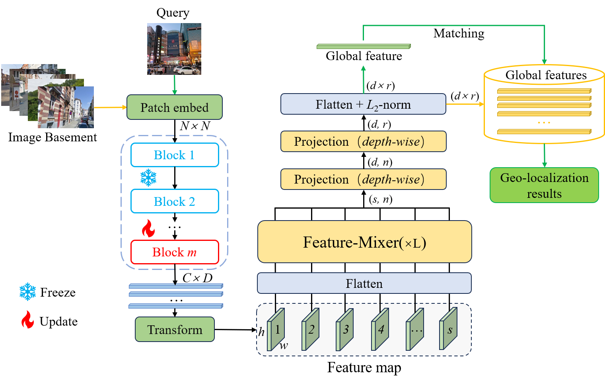

# DINO-Mix: Enhancing Visual Place Recognition with Foundational Vision Model and Feature Mixing

This is the official repo for "**DINO-Mix: Enhancing Visual Place Recognition with Foundational Vision Model and Feature Mixing"**

### Summary

 Although most current VPR methods achieve favorable results under ideal conditions, their performance in complex environments, characterized by lighting variations, seasonal changes, and occlusions caused by moving objects, is generally unsatisfactory. Therefore, obtaining efficient and robust image feature descriptors even in complex environments is a pressing issue in VPR applications. In this study, we utilize the DINOv2 model as the backbone network for trimming and fine-tuning to extract robust image features. We propose a novel VPR architecture called DINO-Mix, which combines a foundational vision model with feature aggregation. This architecture relies on the powerful image feature extraction capabilities of foundational vision models. We employ an MLP-Mixer-based mix module to aggregate image features, resulting in globally robust and generalizable descriptors that enable high-precision VPR. We experimentally demonstrate that the proposed DINO-Mix architecture significantly outperforms current state-of-the-art (SOTA) methods. In test sets having lighting variations, seasonal changes, and occlusions (Tokyo24/7, Nordland, SF-XL-Testv1), our proposed DINO-Mix architecture achieved Top-1 accuracy rates of 91.75%, 80.18%, and 82%, respectively. Compared with SOTA methods, our architecture exhibited an average accuracy improvement of 5.14%.


The link of this paper:[[ArXiv](https://arxiv.org/abs/2311.00230)]   <b> Under review</b>

The architecture of DINO-Mix as follows:



## Trained models of DINO-Mix

All models have been trained on GSV-Cities dataset (https://github.com/amaralibey/gsv-cities).


### Weights

<table>
<thead>
  <tr>
    <th rowspan="2">Architecture</th>
    <th rowspan="2">Mix layer</th>
    <th rowspan="2">Output<br>dimension</th>
    <th colspan="3">Pitts30k-val</th>
    <th colspan="3">Pitts30k-test</th>
    <th rowspan="3">Size</th>
    <th rowspan="2">Baidu Netdisk Password：DVPR<br></th>
  </tr>
  <tr>
    <th>Top1</th>
    <th>Top5</th>
    <th>Top10</th>
    <th>Top1</th>
    <th>Top5</th>
    <th>Top10</th>
  </tr>
</thead>
<tbody>
  <tr>
    <td>ViTg14-Mix</td>
    <td>2</td>
    <td>4096</td>
    <td>92.34</td>
    <td>98.59</td>
    <td>99.20</td>
    <td>87.71</td>
    <td>94.25</td>
    <td>96.11</td>
    <td>4.2G</td>
    <td><a href="https://pan.baidu.com/s/1I9PFuHw6FW7rPeV0vkR_0A">LINK</a></td>
  </tr>
  <tr>
    <td>ViTl14-Mix</td>
    <td>2</td>
    <td>4096</td>
    <td>93.86</td>
    <td>99.13</td>
    <td>99.68</td>
    <td>91.27</td>
    <td>96.43</td>
    <td>97.62</td>
    <td>1.1G</td>
    <td><a href="https://pan.baidu.com/s/1G7Kah4ThLZct2tg_x9Mr-A">LINK</a></td>
  </tr>
  <tr>
    <td><b>ViTb14-Mix</b></td>
    <td>2</td>
    <td>4096</td>
    <td>94.37</td>
    <td>98.86</td>
    <td>99.41</td>
    <td>92.03</td>
    <td>95.89</td>
    <td>97.17</td>
    <td>334.4M</td>
    <td><a href="https://pan.baidu.com/s/1KS0R4_yneM5eEk3MozkfoQ">LINK</a></td>
  </tr>
  <tr>
    <td>ViTs14-Mix</td>
    <td>2</td>
    <td>4096</td>
    <td>93.24</td>
    <td>98.54</td>
    <td>99.21</td>
    <td>90.61</td>
    <td>95.61</td>
    <td>97.01</td>
    <td>86.7M</td>
    <td><a href="https://pan.baidu.com/s/1GRMb3qQWXIQo8sECl5dJvw">LINK</a></td>
  </tr>
</tbody>
</table>

## Pretrained models of DINOv2

<table style="margin: auto">
  <tr>
    <th>model</th>
    <th># of<br />params</th>
    <th>ImageNet<br />k-NN</th>
    <th>ImageNet<br />linear</th>
    <th>download</th>
  </tr>
  <tr>
    <td>ViT-S/14 distilled</td>
    <td align="right">21 M</td>
    <td align="right">79.0%</td>
    <td align="right">81.1%</td>
    <td><a href="https://dl.fbaipublicfiles.com/dinov2/dinov2_vits14/dinov2_vits14_pretrain.pth">backbone only</a></td>
  </tr>
  <tr>
    <td>ViT-B/14 distilled</td>
    <td align="right">86 M</td>
    <td align="right">82.1%</td>
    <td align="right">84.5%</td>
    <td><a href="https://dl.fbaipublicfiles.com/dinov2/dinov2_vitb14/dinov2_vitb14_pretrain.pth">backbone only</a></td>
  </tr>
  <tr>
    <td>ViT-L/14 distilled</td>
    <td align="right">300 M</td>
    <td align="right">83.5%</td>
    <td align="right">86.3%</td>
    <td><a href="https://dl.fbaipublicfiles.com/dinov2/dinov2_vitl14/dinov2_vitl14_pretrain.pth">backbone only</a></td>
  </tr>
  <tr>
    <td>ViT-g/14</td>
    <td align="right">1,100 M</td>
    <td align="right">83.5%</td>
    <td align="right">86.5%</td>
    <td><a href="https://dl.fbaipublicfiles.com/dinov2/dinov2_vitg14/dinov2_vitg14_pretrain.pth">backbone only</a></td>
  </tr>
</table>


Code to load the pretrained weights is as follows:

```
from DINO_Mix import VPRModel

# Note that images must be resized to 224x224
model = VPRModel(
    backbone_arch='dinov2_vitb14',
    pretrained=True,
    layer1=8,
    use_cls=False,
    norm_descs=True,

    # ---- Aggregator
    agg_arch='DinoMixVPR',
    agg_config={'in_channels': 768,
                'in_h': 16,
                'in_w': 16,
                'out_channels': 1024,
                'mix_depth': 2,
                'mlp_ratio': 1,
                'out_rows': 4},
    )

checkpoint = torch.load(r"\DINO-Mix\dinov2_vitb14.ckpt", map_location='cuda')
if 'state_dict' in checkpoint:
    state_dict = checkpoint['state_dict']
else:
    state_dict = checkpoint
model_dict_weight = model.state_dict()
state_dict = {k: v for k, v in state_dict.items() if
              k in model_dict_weight}
model_dict_weight.update(state_dict)

# Find missing and unexpected weight parameters for pretrained models
missing_keys, unexpected_keys = model.load_state_dict(state_dict, strict=False)
print("[missing_keys]:", *missing_keys, sep="\n")
print("[unexpected_keys]:", *unexpected_keys, sep="\n")
# Finally, load the content of the model pre-trained parameters
model.load_state_dict(model_dict_weight)
```

## Bibtex

```
@misc{huang_dino-mix_2023,
	title = {DINO-Mix: Enhancing Visual Place Recognition with Foundational Vision Model and Feature Mixing},
	url = {https://arxiv.org/abs/2311.00230},
	urldate = {2023-11-02},
	publisher = {arXiv},
	author = {Huang, Gaoshuang and Zhou, Yang and Hu, Xiaofei and Zhang, Chenglong and Zhao, Luying and Gan, Wenjian and Hou, Mingbo},
	month = oct,
	year = {2023},
}
```

## Acknowledgements
This code is based on the amazing work of:
 - [MixVPR](https://github.com/amaralibey/MixVPR)
 - [GSV-Cities](https://github.com/amaralibey/gsv-cities)
 - [DINOv2](https://github.com/facebookresearch/dinov2)
